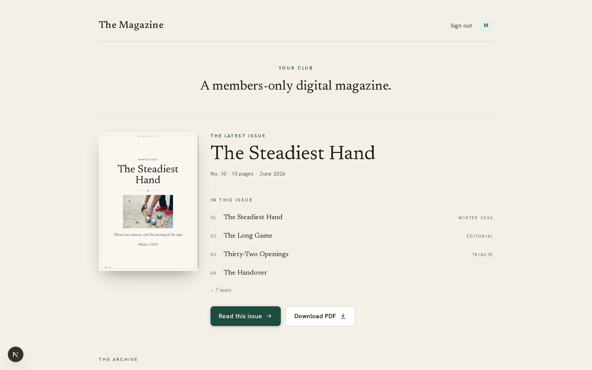
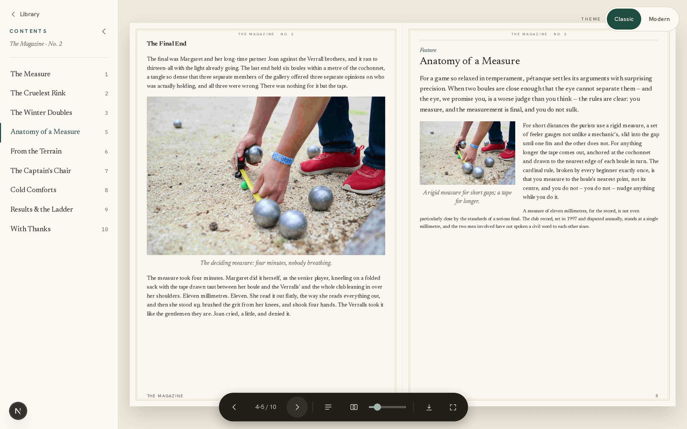
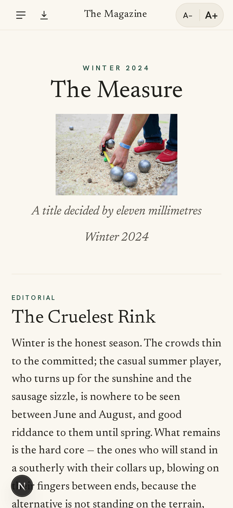
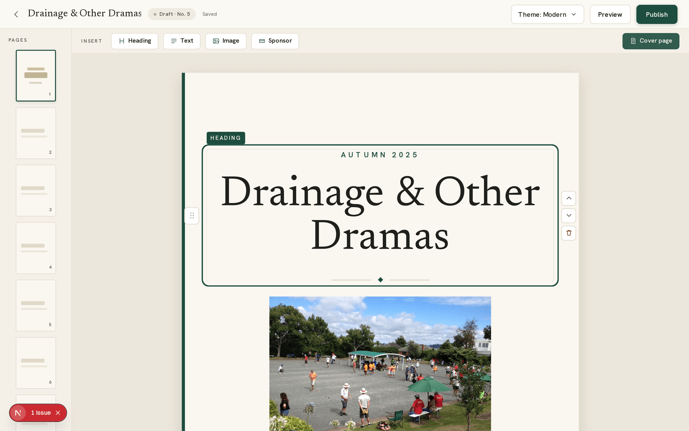

# octavo

**A members-only digital magazine for a club.** An admin authors page-based issues in a
visual editor; members read them as a page-turning flipbook on desktop or a clean scroll on
mobile. Access is by magic link — no passwords, membership is presence in the members table.

[](https://github.com/AlexSandilands/octavo/actions/workflows/ci.yml)
[](https://nextjs.org)
[](https://react.dev)
[](https://www.typescriptlang.org)
[](https://tailwindcss.com)
[](https://orm.drizzle.team)
[](https://prettier.io)
[](https://railway.app)

<p align="center">
  
</p>

> octavo is the platform; the magazine's name, club name and tagline are all configurable —
> the screenshots below show the default "The Magazine" / "Your Club" branding.

## Screenshots

### Reader — desktop flipbook

Two-page spreads that turn like a real book, with a contents rail, per-session layout theme,
zoom, and a one-click PDF download.

<p align="center">
  
</p>

### Reader — mobile scroll & the editor

On a phone the same issue becomes a clean, adjustable-type scroll (left). The admin authors
issues in a live, autosaving block editor with a page rail and a WYSIWYG cover (right).

<p align="center">
  
  &nbsp;&nbsp;
  
</p>

## Features

- **Page-based issues** — a block/content model (headings, rich text, images, sponsors)
  laid out on fixed-canvas pages, not a blog feed.
- **Two readers, one issue** — a custom CSS-transform flipbook on desktop, a scroll reader
  on mobile; the right one is chosen by viewport and the other's bundle never ships.
- **Magic-link auth, members only** — Auth.js v5, database sessions (~90 days). Signed-out
  visitors are sent to sign-in with a validated return path; the library and reader are gated.
- **Admin editor with autosave** — a visual block editor with a page rail, drag-to-reorder,
  live preview and a per-issue publish flow.
- **Real image pipeline** — uploads are converted to WebP (via sharp) and served from
  Cloudflare R2, with a local-disk fallback so it runs with no cloud setup.
- **Sponsors** — a managed sponsors table with logo upload, link and expiry, referenced from
  issues through an editor picker.
- **Publish-time email blast** — publishing can email every subscribed member a personal
  magic link that opens the new issue, each with a signed one-click unsubscribe.
- **On-demand PDF export** — a members-only endpoint prints an issue's fixed-canvas pages to
  a paginated PDF via headless Chromium (Playwright), cached in R2 and regenerated only when
  the content changes.
- **Built for the audience** — an older, phone-heavy, accessibility-sensitive readership:
  large tap targets, adjustable type, and a contrast gate on every change.

## Tech stack

Next.js 15 (App Router) · React 19 · TypeScript · Tailwind v4 · Drizzle ORM (Postgres) ·
Auth.js v5 (magic link) · Resend (email) · Cloudflare R2 via the AWS S3 SDK · sharp (WebP) ·
a custom CSS-transform flipbook (`src/features/reader/reader-spread.tsx`) · Playwright
(on-demand PDF). Hosted on Railway. See [infrastructure.md](docs/infrastructure.md).

## Getting started

```bash
npm install
docker compose up -d          # local Postgres (see docker-compose.yml)
npm run db:migrate            # apply committed migrations
npm run db:seed               # wipe + load 10 sample issues (with images) for the reader
npm run db:admin -- you@example.com   # bootstrap an admin (idempotent)
npm run dev                   # http://localhost:3000
```

Then open <http://localhost:3000>, enter your email on the sign-in page, and **the magic
link is printed to the dev server console** — no Resend account needed locally. Sign in with
the admin address to reach `/admin`.

Branding and `DATABASE_URL` live in `.env.local` (git-ignored); see `.env.example` for every
key. Local uploads land in `.data/uploads` until R2 is configured. `npm run db:push` is a
faster schema-sync convenience for local iteration — see [database.md](docs/database.md) for
when to use it versus migrations.

## Documentation

- [Architecture](docs/architecture.md) — system overview, directory map, data flow, routes, env.
- [Database](docs/database.md) — schema, the content/block model, migrations, seeding.
- [Design principles](docs/design-principles.md) — engineering + design rules (**read first**).
- [Roadmap](docs/ROADMAP.md) — phase ordering, product decisions; work is tracked as GitHub issues.
- [Workflow](docs/workflow.md) — the per-issue process, model routing, and required gates.
- [Infrastructure](docs/infrastructure.md) — hosting components, setup order, costs.

## Status

Library, reader, dashboard and editor are DB-backed; auth, images, sponsors, publish-time
email and PDF export are all real — nothing is stubbed. See the roadmap for what's next.

---

A private project — all rights reserved. Not licensed for redistribution.
